<h1 align="center">Hi 👋, I'm Alok</h1>
<h3 align="center">A passionate software developer from India</h3>

 
   

  

## 👨‍💻 About Me

- 🔭 I'm currently working on exciting projects in web and mobile development
- 🌱 Learning advanced cloud technologies and system design
- 👯 Looking to collaborate on open-source projects
- 💬 Ask me about full-stack development, DevOps, or tech in general
- 📫 How to reach me: **waynerooney0089@gmail.com**
- 😄 Pronouns: He/Him
- ⚡ Fun fact: I can solve a Rubik's cube in under 2 minutes!

## 🛠️ Tech Stack

### Languages

  

### Technologies & Tools

  

## 🌐 Connect With Me

  
  

## 📊 GitHub Stats

  <table>
    <tr>
      <td>
        
      </td>
      <td>
        
      </td>
    </tr>
  </table>
  
  

## 🏆 GitHub Trophies

  

## 🗓️ Contribution Calendar

## 🎖️ Achievements

  
  
  

## 📂 Projects
All of my projects are available at [pseudophoenix.github.io](https://pseudophoenix.github.io)